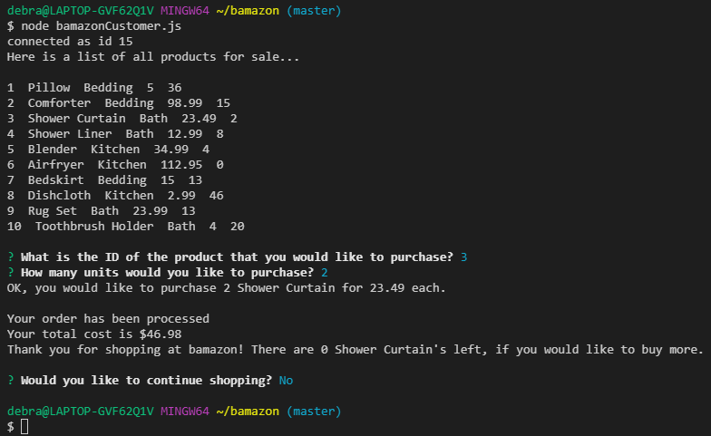
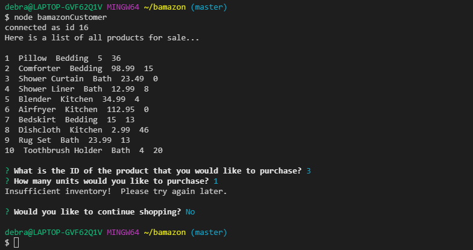

# Overview
In this activity, I created an Amazon-like storefront with the MySQL skills learned. This app takes in orders from customers and deplete stock from the store's inventory. This app also tracks product sales across departments and then provides a summary of the highest-grossing departments in the store.
_______________________________________________________________________________________________________________________

# Technologies Used
* mySQL Database
* Node
    * Inquirer
* JavaScript
_______________________________________________________________________________________________________________________

# Customer View

_______________________________________________________________________________________________________________________
